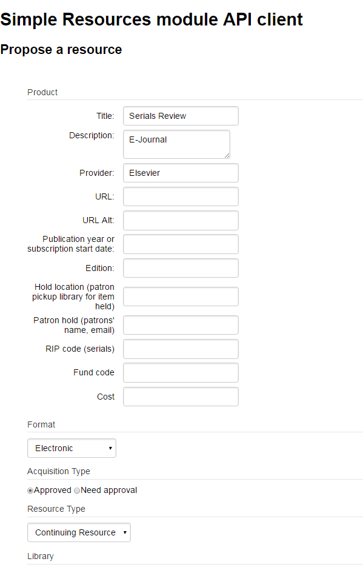
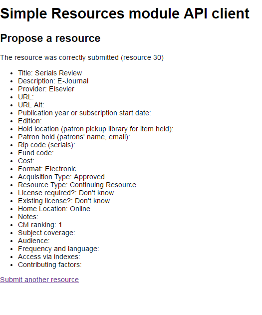

## Propose New Resource API

This API allows users to submit a new resource to CORAL Resource module via a client form. 

### The API and the Client Form 
The API is based on [Flight](http://flightphp.com/), a simple and extensible framework for PHP.   

This is a sample of a client form, which is based on [unirest]( http://unirest.io/php.html ). Users can enter resource information in the form. In this example, Product information is entered in several text fields including Title, Description, Provider, etc. For Format, Acquistion Type, Resource Type, and other fields, what's showing on the form are populated from the data predefined in Coral Admin tab. For fields with data filled in, they are mapped to the existing CORAL fields including Title, Description, URL, Alt URL, Fund Code, Cost, Format, Acquisition Type, and Resource Type. Other fields without a matching CORAL fields are loaded into CORAL as general notes. If a specific note type is created in CORAL, they can be mapped to the desired note type.  

Once submitted, a report is presented with a summary of the fields entered as shown above. A new resource record is created automatically in CORAL Resource module, and data on the from may be mapped to the corresponding fields in CORAL. If data entered in Format, Acquisition Type and Resource Type match with what determine a workflow, the workflow is triggered once the record is submitted via the client form. 

### API Configuration

#### Server-side:

Edit resources/admin/configuration.ini and fill apiAuthorizedIP with the IP address of the client accessing the API:
apiAuthorizedIP="192.168.1.1"

You can set multiple IPs (comma-separated):
apiAuthorizedIP="192.168.1.1,192.168.2"

You can also set incomplete IPs so the whole range will be allowed:
apiAuthorizedIP="192.168.1"
(will authorize all IPs from 192.168.1.1 to 192.168.1.255)

If you are trying to test the example form and it is on the same machine as Coral, 127.0.0.1 should work.

Hint: if you don't know which IP address will be requesting the API, just leave apiAuthorizedIP blank (apiAuthorizedIP="") and access the example form with your browser (http://yourcoral.tld/resources/api_client/ ), you will get an error like this:
You are not authorized to use this service.
Unauthorized IP: 127.0.0.1

#### Client-side:

Edit api_client/index.php and set the $server variable:
$server = "http://yourcoral.tld/resources/api/"; 
