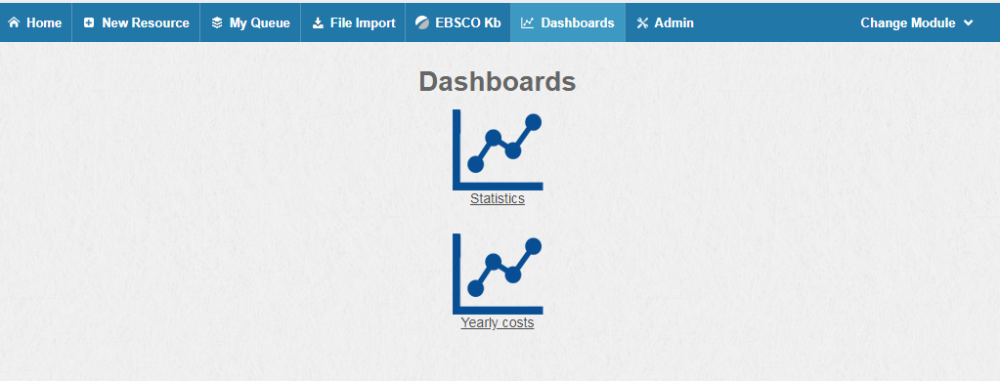
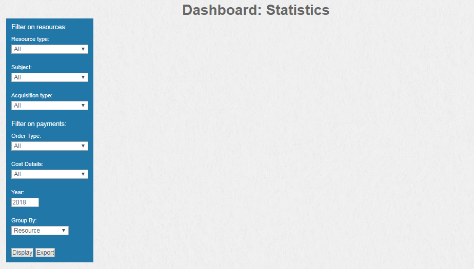
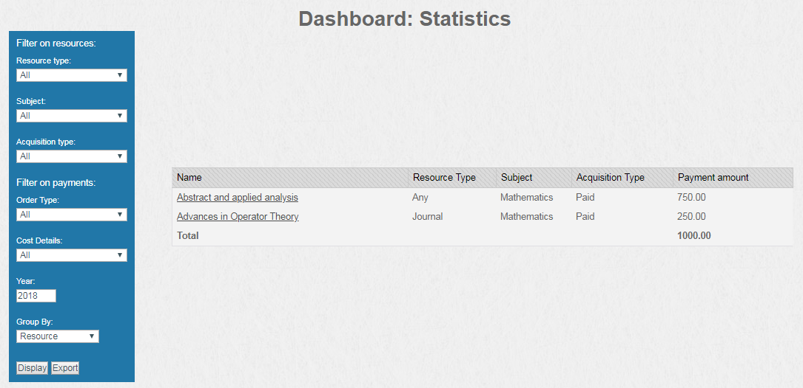
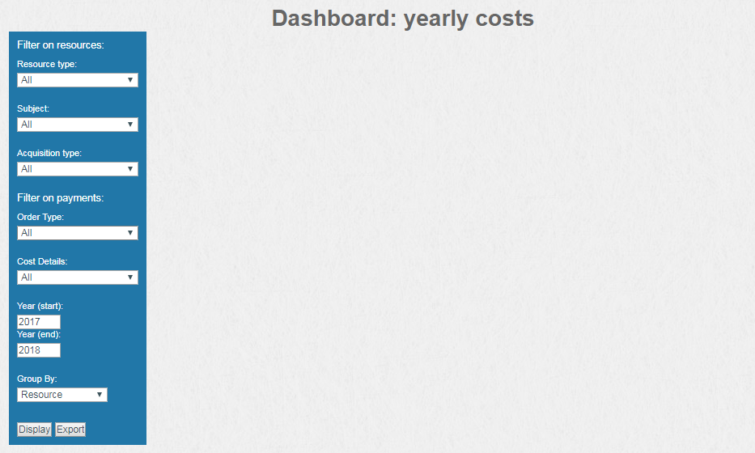

Dashboards User Guide
---------------------------------

### About CORAL Resources Dashboards

The CORAL dashboards provide a quick overview of resource and cost info.

Note: Enhanced Cost history must be enabled to use Dashboards in CORAL. See [Additional Server Configuration](http://docs.coral-erm.org/en/latest/manual.html#additional-server-configuration)

### Statistics Dashboard

Dashboards Statistics allows for a quick display of your Resources data by Resource Type, Subject, Acquisition Type, Order Type, Cost Details, and Year.  You can also Group By: Resource, Resource Type, Subject, and Acquisition Type.  Once your criteria has been selected click Display to view your results or Export to export your results.  

### Yearly Costs Dashboard

Yearly Costs allows for a quick display of your Resources data by Resource Type, Subject, Acquisition Type, Order Type, Cost Details, and Year Start and end dates.  You can also Group By: Resource, Resource Type,  Subject, and Acquisition Type.  You can also view total sum for all cost details. Once your criteria has been selected click Display to view your results or Export to export your results. 

 

 

 
