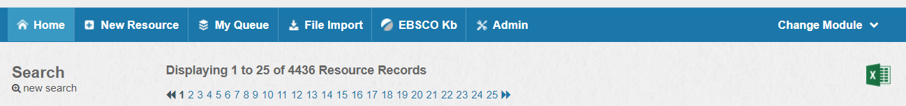
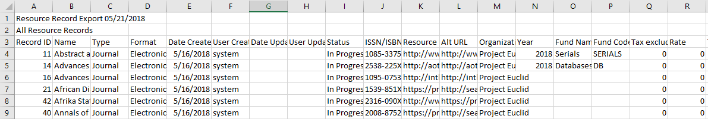

Exporting in CORAL
---------------------------------

The export feature allows users to retrieve data from the Resources module in CSV (spreadsheet) format. 

### How to Export Resources

To export resources, click the green Excel icon on the right side of the screen, under the Change Module menu.   

Note: If your Resources module has a lot of records, you may need to wait for the file to be prepared. 

A dialogue box will appear asking where you want to save the file, which will be named `resources_export_today's_date.csv`. Choose a folder and click Save. 

You can then open the file on your computer using Excel, OpenOffice, Google Sheets, or another spreadsheet program.

Note: If there are multiple values in a field, they will be separated by a semicolon and a space.

### Exported Fields

- Resource ID: The unique identifier of each resource record.

- Date Created

- User Created: The name of the user who created the record.

- Date Updated: The date of the last update to the record.

- User Updated: The name of the user who last updated the record.

- Status: Whether the resource record is In Progress or Complete.

*Product Tab:* 

- Name: The title of the resource.

- Type

- Format

- ISSN/ISBN

- Resource URL

- Alt URL

- Organizations

- Aliases

- Parent Resource: The name of any linked parent resource record.

- Child Record: The name of any linked child resource records.

*Orders Tab:*

- Order Type

- Acquisition Type

- Order Number

- System Number

- Purchasing Sites

- Subscription Alert Enabled

*Acquisitions Tab:*

- Sub Start

- Current Sub End

- Year

- Fund Name

- Fund Code

- Tax Excluded

- Rate

- Tax Included

- Payment 

- Currency

- Details: Cost details.

- Cost Note

- Invoice

- License Names

- License Status

*Access Tab:*

- Authorized Sites

- Administering Sites

- Authentication Type

- Access Method

- Storage Location

- Simultaneous User Limit

- Coverage

- Username

- Password

*Cataloging Tab:*

- Cataloging Type

- Cataloging Status

- Catalog Record Set Identifier

- Catalog Record Source URL

- Catalog Records Available

- Catalog Records Loaded

- OCLC Holdings Updated

Fields currently missing from the list above: 

- Organization Role

- Description 

- Alias Type

Not currently exported are fields inherited from other modules that appear in the Contacts and Accounts tabs. Nor are issues, attachments, or workflows exported.  
