Installing CORAL
----------------

### Installation 
Installation can occur in one of two ways – either through the web installation script or manually.  For a manual installation see [Installing CORAL Manually](http://docs.coral-erm.org/en/latest/manual.html).  The web 
installation will provide advantages over manual installation because it will check MySQL privileges and PHP version and directory permissions.

#### Software Requirements

CORAL 2.0 requires the following:

> PHP 5.5 or above
> 
> MySQL 5.5 or above (Another alternative supported is MariaDB 10 or above)
> 
> Apache 2.2 or above 

#### Installing CORAL 2.0

Note: For upgrading to CORAL 2.0 see the following section [Upgrading to CORAL](http://docs.coral-erm.org/en/latest/install.html#upgrading-to-coral)

New to CORAL 2.0 is the Unified Installer which simplifies the web installation.

Step 1: Download a copy of the [latest version at Github](https://github.com/Coral-erm/Coral/releases).

Step 2: If you use the option to download the compressed zipped file, expand this file in a working folder.

Step 3: Copy the expanded folder to your webserver.  If using Apache, this would be something like 
`/var/www/html/` folder.  If CORAL will be in a sub folder on your webserver, change the folder name from "Coral-master" to, for example, "coral" or what name you choose.

The web installation depends upon the index.php file found in the coral folder.  Your Apache settings should be set to include loading the index.php file.  

Step 4: Go to the home directory via a web browser to initiate the United Installer script.  

You should see the following.

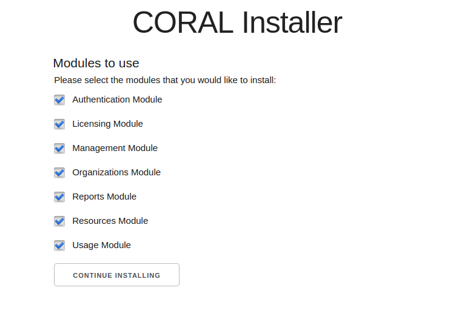

Step 5: All the modules are selected by default.  De-select any modules not required for your installation and then click the "Continue Installing" button.

Step 6: Follow the instructions for any messages received.

For example, you may receive a message asking to change the folder and file permissions similar to the following.

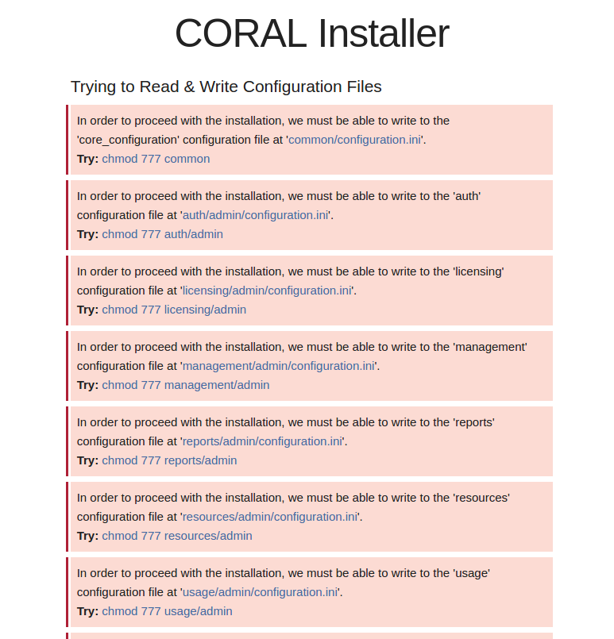

For example, to correct the file and folder permissions in Linux you would do something similar to the this via your terminal.  Be sure to to run these commands in your Coral folder on the web server.

For example, for Ubuntu Linux you would have something similar to the following.  

    sudo chmod 777 common

    sudo chmod 777 auth/admin 

... and so on.

When finished changing the permissions, click on "Try Again" button to continue the installation.

Step 7: Following this you should see the following, setup CORAL with your MySQL.  Generally, this will be user root or an user that has the necessary privileges (i.e., select, insert, update, 
delete, and create table privileges). This user will not be remembered after the installation since part of the process is to create a new user for CORAL to use in day to day operation. 
However, if you don't want to give the installer user credentials with create database permissions, you can provide one with permission only for specific databases, but you will need to manually create a database for each module and use the Advance MySQL Database Setup form to provide the database names to the installer. After providing the necessary information click the "Continue Installing" button. 

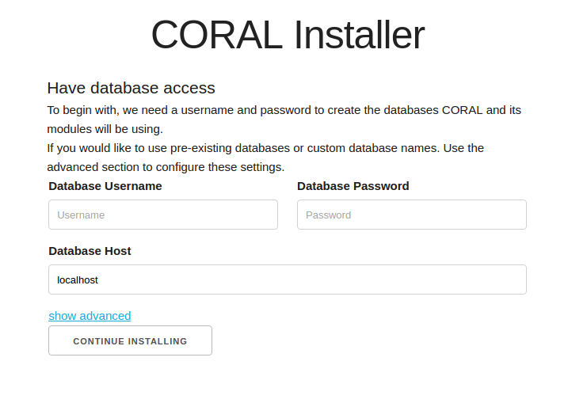

Optional - Advance MySQL Database Setup form as seen below will allow you to customize your database names.

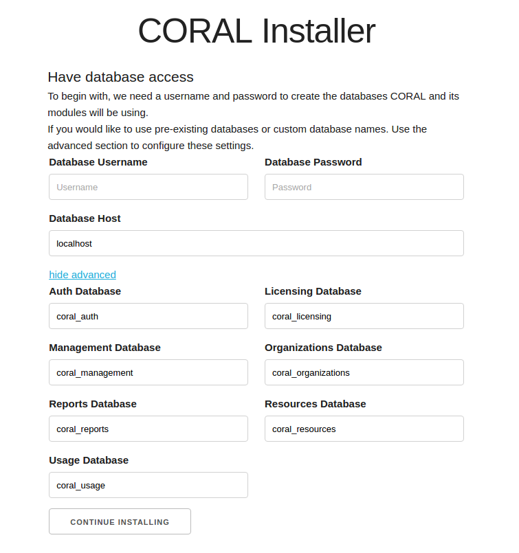

Step 8: Setup a regular database user.  As noted this user will need SELECT, INSERT, UPDATE and DELETE privileges. If the MySQL username you already gave CORAL has permission to create a new user it will create the name and password you provide here. Otherwise you will need to provide a username and password that you have manually configured in the database already. When finished adding the username and password click the "Continue Installing" button. 

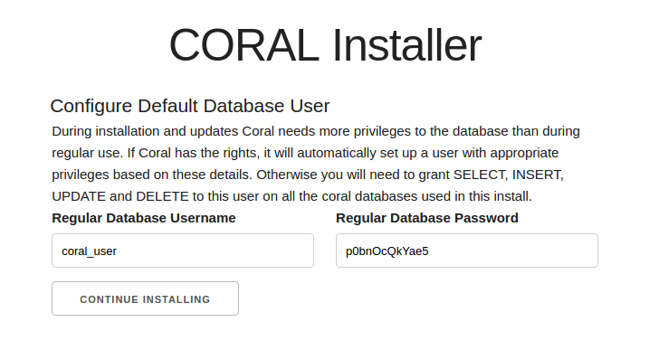

Step 9: Setup default user.  This account will be used to administer other users and features in CORAL.

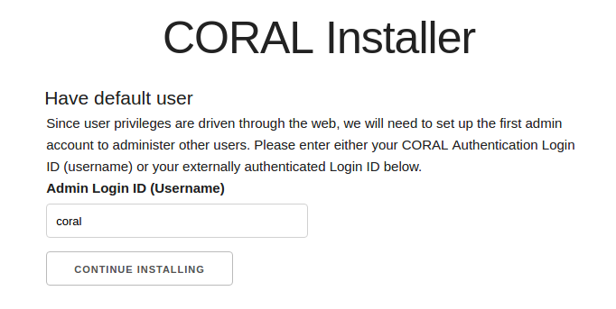

Step 10: Setup for Auth Module.  This includes setting up the session timeout and the whether or not to use [LDAP](https://en.wikipedia.org/wiki/Lightweight_Directory_Access_Protocol) for authentication.  The session timeout represents seconds.  When finished click the "Continue Installing" button.

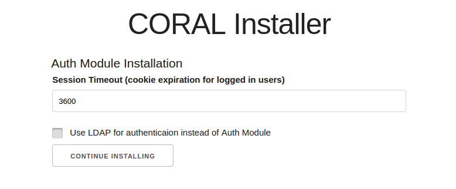

Step 11: If not using LDAP, setup an admin password for the Auth Module.  Passwords must be at least 8 characters long.

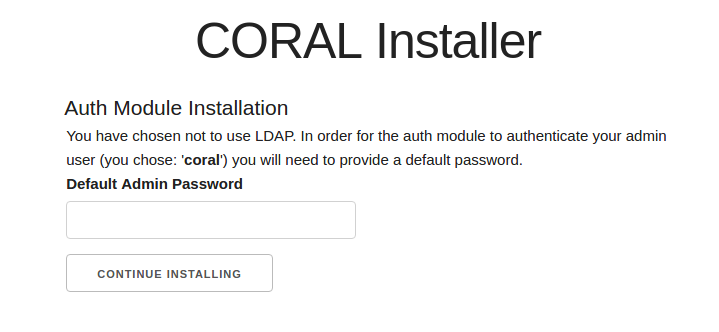

Step 12: Choose whether or not to use the [Terms Tool](http://docs.coral-erm.org/en/latest/terms.html) functionality.

Step 13: Setup Link Resolver Base URL and Outlier Flagging Feature

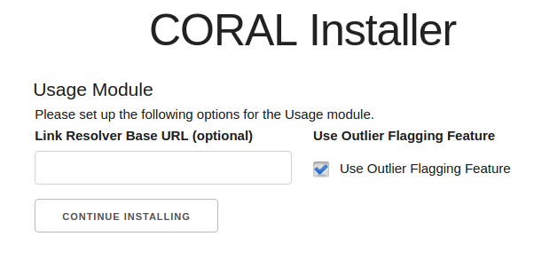

The Link Resolver Base URL provides a quick way to view complete holdings from within the Usage Module.  Likewise, the Outlier Flagging is used in the Usage Module to help flag imported usage data that appears incorrect.  See the [Usage Statistics Guide](http://docs.coral-erm.org/en/latest/usagestats.html) for more information.

Again, click the "Continue Installing" button when finished. 

Step 14: Setup Resources Module

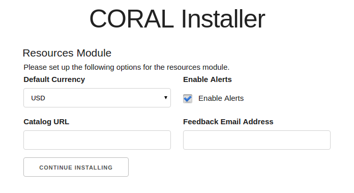

Step 15: As instructed update your file permissions for better security.

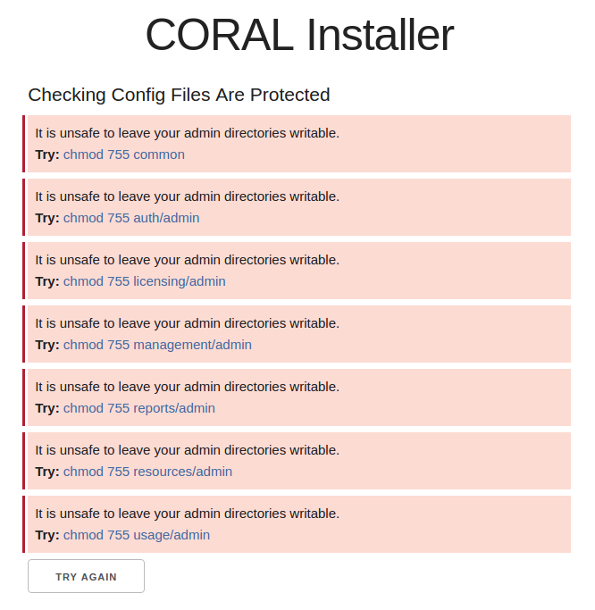

When finished updating click on the "Try Again" button.

When finished you should briefly see a message indicating what modules have been successfully installed.  The message will redirect to the CORAL home page in 10 seconds.

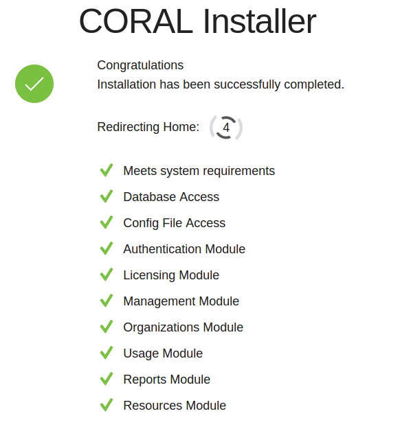

#### Upgrading CORAL

Note: To upgrade to CORAL 2.0 and following you need to be sure all your modules are updated to the latest 1.x versions.  Before starting any upgrade process make a backup of your previous CORAL installation and data.

**Installation Notes:**
* There is a separate install for each 1.x module
* The CORAL-Main module does not have an installation script. You simply need to copy the module files into the parent `/coral/` folder.
* If you need to re-run the installation for any reason, you can do so **but it will remove any data in the 
database and reset to original data load!** 
* Be sure to remove the `/install/` directory once installation is complete.

##### Steps for Upgrading to the latest 1.x versions

**Auth Module**

Step 1: [Download the latest 1.x Auth Module (v.1.1.1)](https://github.com/ndlibersa/auth/archive/v1.1.1.zip) and unzip the file into a webserver folder.

Step 2: Copy the `configuration.ini` file from the `admin` folder of your current Auth module into the `admin` folder of the latest Auth module.  

**PLEASE NOTE: For all the following steps "latest ... module" refers to your expanded download of the latest version of CORAL that you are upgrading to.**

Your Auth module should now be upgraded to the latest version of CORAL 1.x

**Resources Module**

Step 1: [Download the latest 1.x Resources Module (v1.4.1)](https://github.com/ndlibersa/resources/archive/v1.4.1.zip) and unzip the file into a webserver folder.

Step 2: Copy the `configuration.ini` file from the `admin` folder of your current Resources module into the `admin` folder of the latest Resources module.

Step 3: Copy the content of the `attachments` folder of your current Resources module into the `attachments` folder of the latest Resources module.

----------
Note:

If you require Unicode support, be sure to check the following settings and update as needed.  Older versions of CORAL/MySQL implementations may not have been setup for Unicode support.  

In the `organizations/install` folder, go to the `update_1.3.sql`.  Remove the comment from the following line and replace the placeholder `_DATABASE_NAME_` with your current Resources module database name.  Be sure to save your changes when finished.

For example if your database name is `coral_productions_prod_v1`.  Find the following line in `update_1.3.sql`: 

`ALTER DATABASE '_DATABASE_NAME_' CHARACTER SET utf8 COLLATE utf8_general_ci`

And change it to the following:

`ALTER DATABASE 'coral_organizations_prod_v1' CHARACTER SET utf8 COLLATE utf8_general_ci `

Step 4: Open up a browser and type the URL pointing to your latest Resource module followed by `/install/update.php` and hit enter.  The v1.4.1 Resource update script can detect your current Resource module version.  Let's assume your current Resource version is v1.0.0.  If so, you should see the first screen below.

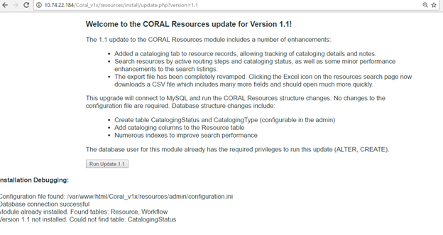

Step 5: Click the "Run Update 1.1" button.

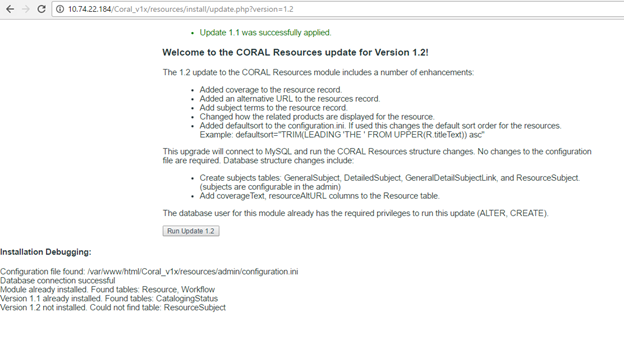
 
Step 6: Click the "Run Update 1.2" button.

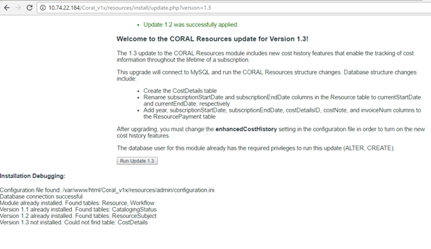

Step 7: Click the "Run Update 1.3" button.

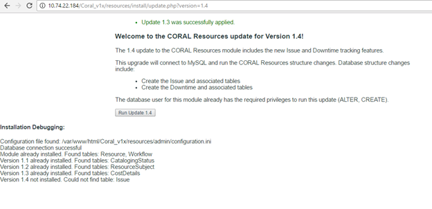

Step 8: Click the "Run Update 1.4" button.

You should now see the following 

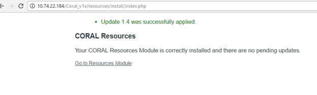

Step 9: Secure or move the install folder under the latest Resources module to a safer location.

**Organizations Module**

Step 1: [Download the latest 1.x Organizations Module (v1.3.1)](https://github.com/ndlibersa/organizations/archive/v1.3.1.zip) and unzip the file into a webserver folder.

Step 2: Copy the `configuration.ini` file from the `admin` folder of your current Organizations module into the `admin` folder of the latest Organizations module.

----------
Note:

If you require Unicode support, be sure to check the following settings and update as needed.  Older versions of CORAL/MySQL implementations may not have been setup for Unicode support.  

In the `install/protected` folder of the latest Organizations module, go to the `update_1.4.sql` file found under the latest Organizations module.  Remove the comment for the following line and replace the placeholder `_DATABASE_NAME_` with your current Resources module database name.  Be sure to save your changes when finished.

Here is the line you are changing.

--ALTER DATABASE '_DATABASE_NAME_' CHARACTER SET utf8 COLLATE utf8_general_ci;

----------

Step 3: Open up a browser and enter the URL pointing to your latest Organizations module followed by `/install/upgrade.php` and hit enter to see the screen below.

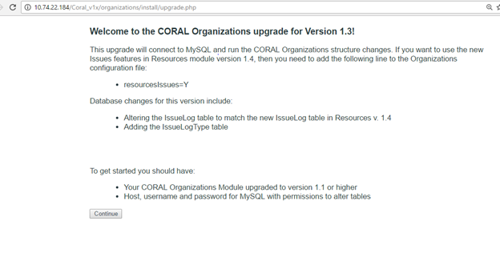

Step 4: Click on the "Continue" button.  The next screen should look like the following.

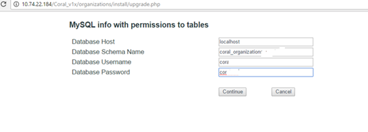

Step 5: Fill in the fields for hostname or IP address of the host where your CORAL database is running, the current Organizations database name, and the database username and password granted permissions to the Organizations database.  Click on the "Continue" button when finished.

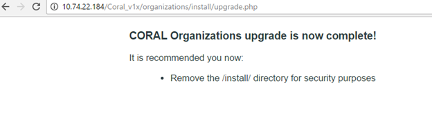 

Step 6: Secure or move the `install` folder under the latest Organizations module to a safer location.

**Licensing Module**

Step 1: [Download the latest 1.x Licensing Module (v1.4.2)](https://github.com/ndlibersa/licensing/archive/v1.4.2.zip) and unzip the file into a webserver folder.

Step 2: Copy the `configuration.ini` file from the `admin` folder of your current Licensing module into the `admin` folder of the latest Licensing module.

Step 3: Copy the content of the `attachments` folder from your current Licensing module into the `attachments` folder of the latest Licensing module.

Step 4: Copy the content of the `documents` folder from your Licensing module into the `documents` folder of the latest Licensing module.

Step 5: Open up a browser and enter the URL pointing to your v.1.4.2 Licensing module followed by `/install/update.php` and hit enter.  You should see the following.

Step 6: Click the "Run Update 1.2" button.

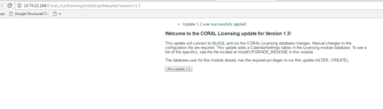

Step 7: Click the "Run Update 1.3" button.

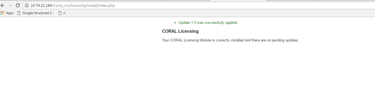

Step 8: Since there are no database changes since v.1.3.0, your installation is updated to v.1.4.2.  Secure your CORAL installation by moving the latest 1.x `install` folder for your Licensing module to another location.

**Management Module**

Step 1: [Download the latest 1.x Management Module (v1.2.0)](https://github.com/ndlibersa/management/archive/v1.2.0.zip) and unzip the file into a webserver folder.

Step 2: Copy the `configuration.ini` file from the `admin` folder of your current Management module into the `admin` folder of the latest Management module.

Step 3: Copy the content from the `attachments` folder of your current Management module into the `attachments` folder of the latest Management module.

Step 4: Copy the content of the `documents` folder of your current Management module into the `documents` folder of the latest Management module.

Step 5: Open up a browser and enter the URL pointing to your latest Management module followed by `/install/update.php` and hit enter.  You should see the following and have Management module v1.2.0 installed.

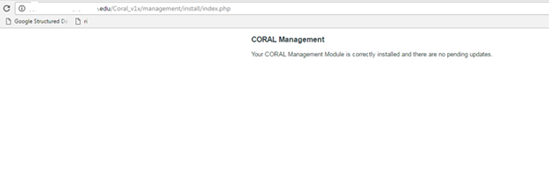 

Step 6: Secure or move the `install` folder for the latest 1.x Management module to a safer location.

**Usage Module**

Step 1: [Download the latest 1.x Usage Module (v1.2.1)](https://github.com/ndlibersa/usage/archive/v1.2.1.zip) and unzip the file into a webserver folder.  Alternatively, for those comfortable with git may prefer to check out v.1.2.1 rather than download.

Step 2: Copy the `configuration.ini` file from the `admin` folder of your current Usage module into the `admin` folder of the latest Usage module.

Step 3: Open up a browser and enter the URL pointing to your latest Usage module followed by `/install/update.php` and then hit enter.  You are on v.1.0.0 and should see the following.

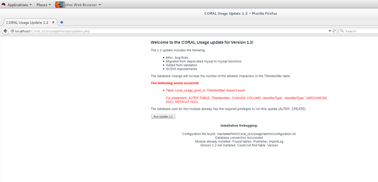

Step 4: Next we need to upgrade from v. 1.0.0 to v1.1.  [Download Usage Module v.1.1](https://github.com/ndlibersa/usage/archive/v1.1.zip) and unzip the file into a webserver folder.  Or, if you use git, switch to v.1.1.  Enter the URL pointing to the v1.1 Usage module followed by `/install/update.php` and hit enter to see the following.

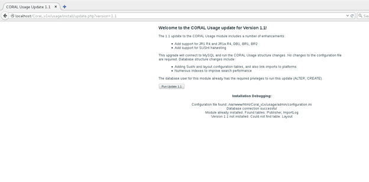

Step 5: Click the "Run Update 1.1"

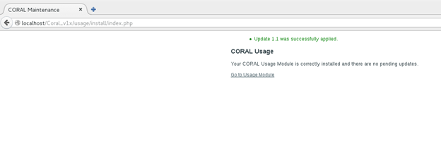

Step 6: Now switch back to the v1.2.1 `update.php` file.  Enter the URL pointing to your latest Usage module followed by `/install/update.php` and hit enter.

Step 7: Click the "Run Update 1.2" button.  You should see the following and have v.1.2.1 installed.

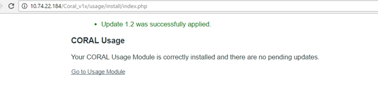

Step 8: Secure or move the install folder for the latest 1.x Usage module to a safer location.

**Reports Module**

Presently, v.1.0.0 is the only version of the Reports module, so there is no need to upgrade this module.

-----

Once you have updated all your existing modules to the latest 1.x version you are ready to start the CORAL 2.0 upgrade.

Step 9: Download a copy of the [latest version at Github](https://github.com/Coral-erm/Coral/releases).

Step 10: If you use the option to download the compressed zipped file, expand this file in a working folder.

Step 11: Copy the expanded folder to your webserver.  If using Apache, this would be something like /var/www/html/ folder.  If CORAL will be in a sub folder on your webserver, change the folder name from "Coral-master" to, for example, "coral" or what name you choose.

The web installation depends upon the index.php file found in the coral folder.  Your Apache settings should be set to include loading the index.php file.  

Step 12: Similar to the upgrade process, move your current `configuration.ini` files found under the `/admin` folders of the version of CORAL you just upgraded into the appropriate `/admin` folders under the new copy of CORAL.  You will need to do this for all the modules you are updating.  

The following is a list of modules applicable:

Auth

Licensing

Management

Organizations

Reports

Resources

Usage

Note: If you want to add a new module to the upgrade, create a new `configuration.ini` under the module's respective `/admin` folder.  Fill out the appropriate settings, such as the CORAL MySQL login info, module database names, URLs, etc.  For a more in-depth description of the `configuration.ini` settings see [Installing CORAL Manually](http://docs.coral-erm.org/en/latest/manual.html)

When finished updating the `configuration.ini` file under all the applicable `/admin` module folders for the new version of CORAL, you are now ready to start the unified installer script.

Step 13: Go to the home directory for the new version of CORAL via a web browser to initiate the United Installer script.  

Using our example folder above, you may have something similar to the following `http://localhost/Coral-master/`.
As long as your Apache server is setup to read by default the `index.php` file, the installation process will start.   

You should see the following.

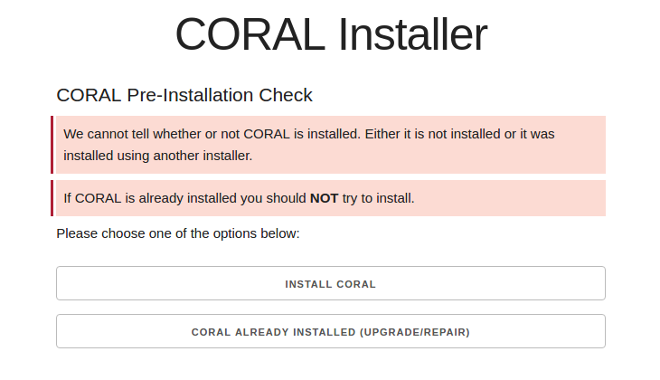

Step 13: Click the "CORAL ALREADY INSTALLED (UPGRADE/REPAIR)" button. 

Following this, you should see the unified installer modules to use list.  

Step 14: All the modules are selected by default.  De-select any modules not required for your installation and then click the "Continue Installing" button.  Remember you should only be selecting modules that you modified the `configuration.ini` for according to Step 12.

Step 15: Follow the instructions for any messages received.

For example, you may receive a message asking to change the folder and file permissions similar to the following.

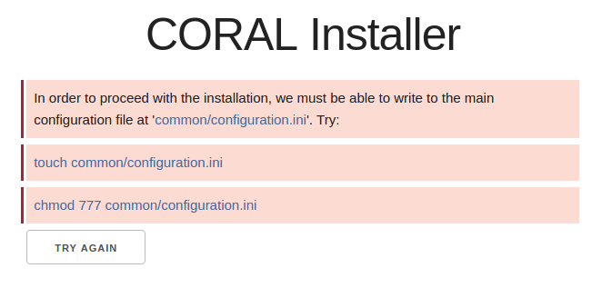

Update the appropriate permissions on your folders and then proceed with the installation by clicking on "TRY AGAIN."

You should receive the following.

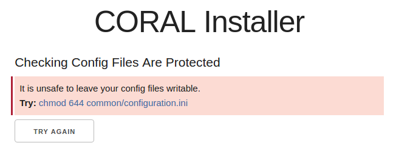

Again, update your permissions to lock your `configuration.ini` file again and click on "TRY AGAIN."

Once finished, you should see the successfully upgraded CORAL 2.0 message before being redirected to the CORAL homepage.

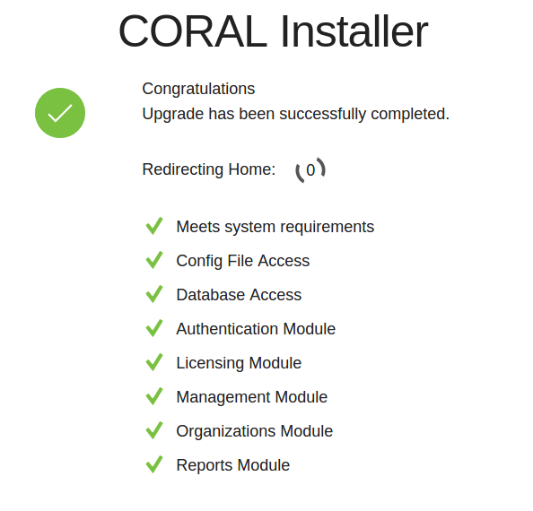
 