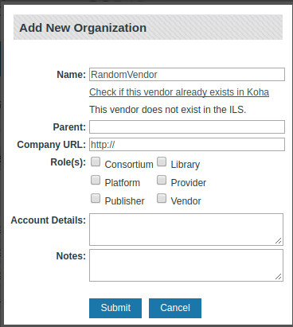
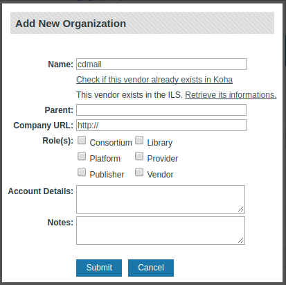
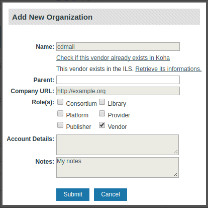
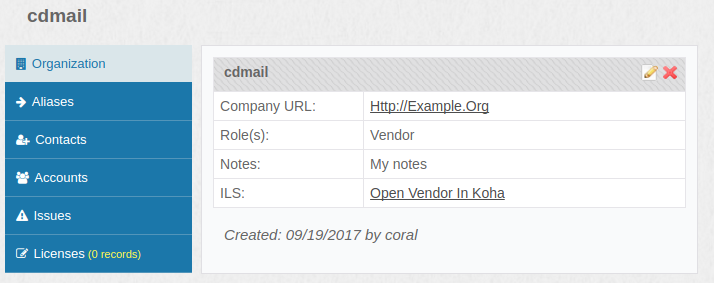

ILS Integration
---------------------------------

### About ILS Integration

Currently only Koha is implemented, but interactions with other ILSes could be added in the future.

#### Koha

Vendors can be synchronized between Coral and Koha. To enable this feature, you have to edit the `[ils]` section in `organizations/admin/configuration.ini`:

`[ils]
ilsConnector=koha
ilsVendorRole="Vendor"
ilsApiUrl="http://mykoha.tld/api/"
ilsAdminUrl="http://pro.mykoha.tld/"`

- `ilsConnector` is the name of the ILS you want to connect to.
- `ilsVendorRole` is the Coral organization role you want to map with Koha vendors.
- `ilsApiUrl` is Koha's API address.
- `ilsAdminUrl` is Koha's intranet address.

Once enabled, you can search for an existing vendor in Koha when creating an organization in Coral:

If the vendor does not already exist in Koha, it will be added if the vendor role has been selected.

If the vendor already exists in Koha, we can automatically retrieve its informations:

In both cases, the vendor can no longer be modified in Coral, as the ILS is authoritative.

Once the Coral organization and the Koha vendor are linked, a link to open the vendor in Koha is displayed:

