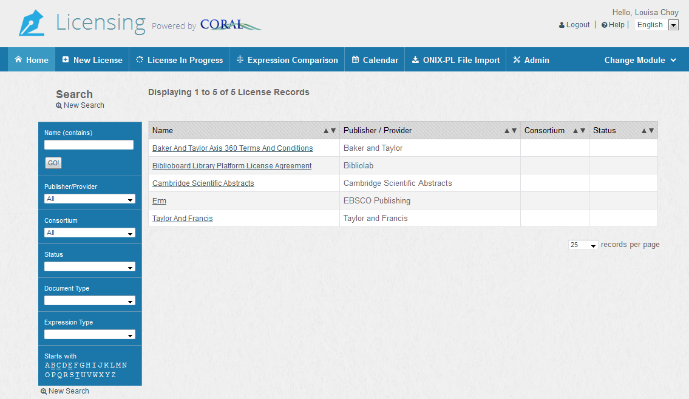
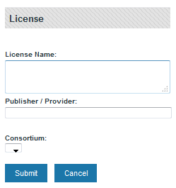
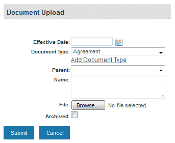
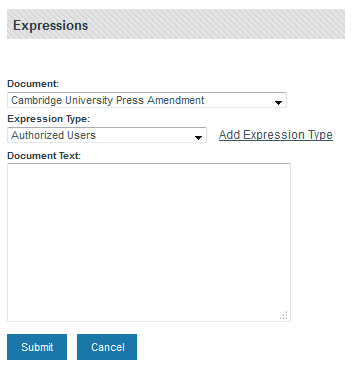
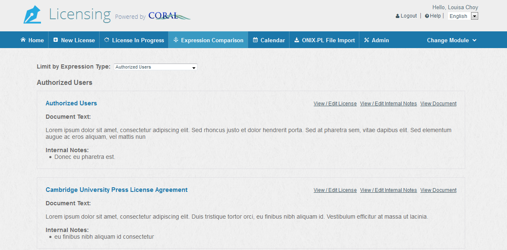
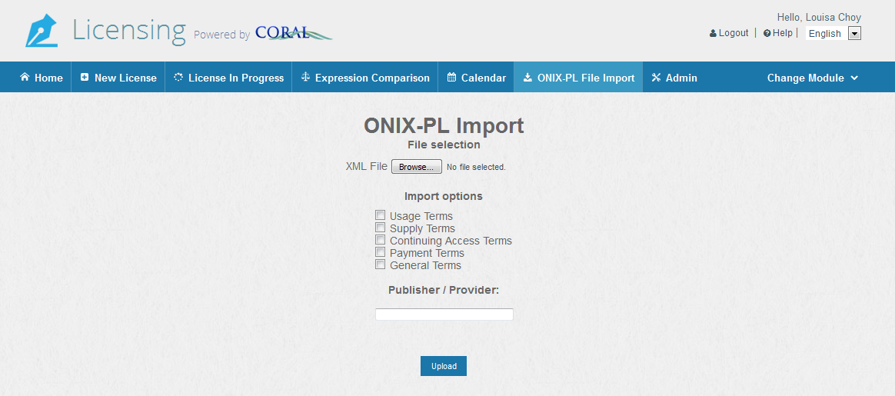
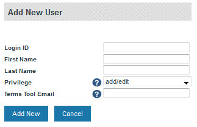

CORAL Licensing User Guide
---------------------------
 
### About CORAL Licensing ###

A component of Hesburgh Libraries locally developed ERM, CORAL
Licensing provides a way to store and access digital copies of current
and expired license agreements and related documents as well as
associated agreement metadata. The licensing module helps make library
license agreements more accessible to personnel through select
searchable metadata fields and assists institutions in tracking and
using specific pieces of information included in legal agreements.
CORAL Licensing is a flexible document management system, useful in
anticipating a variety of agreements and institutional goals for
managing agreements. The module allows users to identify license
clauses most important to record and track from an institutional point
of view. With related features like a clause comparison function, and
ILL and course pack terms tools that can be implemented to deliver
terms through other systems such as SFX, the CORAL Licensing module
provides a way to make better use of permissions included in the
license agreement.

*Please note that screenshots and text in this document are just
examples and do not necessarily reflect terms for a particular
resource.*

### Component Overview

CORAL Licensing has seven major components in the main navigation at
the top of each page.

- Home
- New License
- Licenses in Progress
- Expression Comparison
- Calendar
- ONIX-PL File Import
- Admin

#### Home

The home screen contains a search on the left and a list of license records on the right. The search runs against the following fields: license name, publisher/provider, consortium, license status, document type, and expression type.   

#### New License

Select *New License* from the main navigation to begin adding new licensing records.  This will open the License pop-up window. 

- **License Name:** Name of the license record. A license record can group together all licenses that are either related to each other or related to the same resource. If you have licensed a package of electronic journals from Springer and have over the years collected several licenses and amendments for that package, you can place all of those documents on the same license record.  Then, you need to give the license record a name which gives some indication as to the documents found on that record. In this example ‘Springer Online Journals’ may be a valid license name. If you have license documents for Springer eBooks, you can rename the license to something like 'Springer Online Products'

- **Publisher/Provider:** Name of the licensing organization. In this example Springer would be the publisher/provider.  The publisher/provider field has an auto-fill feature which is populated from the organizations listed in CORAL Organizations. 
 
- **Consortium:** The consortium through which a licensed resource is obtained. The consortium dropdown is populated with any organization assigned a consortium organization type in the Organizations module.

#### Adding / Editing New License Record

Here is a license record which has been created for
'Cambridge University Press Online Journals'. To the right of the
license name are the options to remove the license or to edit the
name, publisher/provider and consortia. Selecting *Edit Organization* next to the publisher/provider name takes you to the Cambridge University Press record within CORAL Organizations. To the far right is the *License Status* dropdown field where you can assign a license record status.  CORAL Licensing includes the following default statuses.

- *Awaiting Document:* License record created but scanned license not yet added.

- *Complete:* License record is complete, no additional work required.
 
- *Document Only:* Document loaded with expressions not identified or loaded.

- *Editing Expressions:* Document loaded and currently adding license terms/expressions.

- *NLR:* No license required.

License Status values can be edited, added or deleted through the
[*Admin*](#Admin) page detailed later in this document. The default values
are simply suggestions for how an institution might consider tracking
agreements.

The license record has four sections located on the left-hand column:

- *Documents*

- *Expressions*

- *Terms Tool*

- *Attachments*

#### Documents

The Documents tab contains all the documents for each license record.
Any document may be uploaded to the system including licenses,
amendments, order forms, purchase requests, or any other important
document. Select *Upload New Document* to begin.

##### Adding New Documents

The *Upload New Document* link opens the window in the below screenshot. Here you can fill out the initial details of the document and upload the actual file. Document Name is the only required field.

- **Effective date:**  The effective date of the agreement, if identified and available.
 
- **Document Type:** Identifies what type of document this is. This is a customizable field which allows each library to set their own terminology. The software comes with the following types included: *Agreement*, *Amendment*, *Countersigned Agreement*, *Internal Acknowledgment*, *Order Form*, and *SERU*. Select the *Add Document Type* link to add new document types.  You can also add a document type by going to the [*Admin*](#Admin) page.  

- **Parent**: Identifies any parent document (ex. You may want to assign a parent document when uploading an amendment).

- **Name:** The title of the document, usually taken directly from the license document.
 
- **File:** Browse and upload a scanned copy of the actual document.

- **Archived:** Used to identify documents which are no longer current
or have been superseded by another agreement. Archived documents are
sorted separate from current documents and are collapsed beneath a
show/hide link to save screen space. Archiving a document does not
delete it from the system. It also does not delete any expressions
attached to that document.

##### Editing Documents

Once added, the documents will display on the *Documents* tab sorted
first by Document Type and then by signature date with most recent first.
Multiple signatures for both licensee and licensor can be added using
the *Add Signatures* link. On the right side of the table are links to
view, edit, and delete each document. 

#### Expressions
The *Expressions tab* is where the expressions or clauses of the license
are entered.  Expressions are not required. You should however assign an appropriate
*License Status* to the record that indicates it is a document only
record. 

##### Adding Expressions
The *Add New Expression* link opens a pop-up window, where you can add expressions for the documents that have been previously loaded.

- **Document:** The document name for which you want to add a new expression. The drop-down is pre-populated from the existing document names in the specific license record. This is a required field.
 
- **Expression Type:** The type of expression you wish to add (interlibrary loan terms, course pack rights, etc). This is a required field.  The software comes with the following expression types already defined: *Authorized Users*, *Confidentiality Clause*, *Course Packs*, *eReserves*, *General Notes*, *Interlibrary Loan*, *Jurisdiction*, *Multi-year Term*, *Post Cancellation Access*, and *Third Party Archiving*.  This field is customizable and you can add types by selecting *Add Expression Type* or going to *Admin*.  In the [*Admin*](#Admin) page, you can specify which expression types are for internal use and which ones can be displayed.  

 
- **Qualifier:** This field will not be available if the selected expression type does not have a qualifier.  This is a customization field which can be used to qualify particular expressions. For example, a qualifier of *Permitted* or *Prohibited* may be appropriate for an Interlibrary Loan expression. You may choose to ignore this field as it may not be appropriate for certain expression types or choose to use it in a different fashion for other expression types.  The software comes with qualifiers added for Coursepacks and Interlibrary Loan.  

- **Document Text:** The actual text of the license clause. 

##### Adding Display / Internal Notes

Actual legal text can be quite confusing so the next step is to add Display or Internal Notes
to hold an interpretation of the text of the clause.  

There are two types of expression notes in CORAL Licensing: *Display
Notes* and *Internal Notes*. You can set the note type to either Internal
or Display for each expression type on the[*Admin*](#Admin) page detailed later
in this document. Display notes are intended to be displayed outside the module, for instance in the Terms Tool, and there is a additional functionality built.  Internal Notes are for internal use only and do not have additional display functionalities built in.  

The *Add/view Display Notes* link opens a window which allows you to enter multiple display notes. It also displays the Document Text on that same window so that you can refer back to it while adding the notes. The sort order of multiple notes can also be adjusted
through this same window. 

In the below example, the Interlibrary Loan expression type has been set to use Display Notes and as such the expression is presented with an additional checkbox to the left of the Document Text. 

Internal Notes do not receive this checkbox. When the licensing librarian or other
appropriate personnel has finished editing the expression
he/she can check this box which indicates that the expression is
finished and it makes the expression available through the Terms Tool. An email is then generated by the system indicating that a new expression has been completed and is ready for display. You can edit the recipients of this email in the [*Admin*](#Admin) page.

#### Terms Tool

Once the expressions or terms of the license are known, the next
question to ask is ‘Which journals are covered by these terms?’.
That’s where the *Terms Tool* tab comes into play. The Terms Tool currently works only with the SFX link resolver.  It is true that not every institution uses SFX.  The *Terms Tool* tab could be renamed and/or repurposed for use with  other openurl resolvers or journal management systems. 

Using this tab it is possible to relate a specific license to the covered journals in a specific SFX target or package. 

In this example, the Cambridge University Press License Agreement is being associated with the 'Cambridge University Press Journals Complete' target in SFX ('Cambridge University Press Journals Complete' is the SFX target public name). This SFX – License connection allows for the delivery of license terms through the SFX menu as detailed in the Terms Tool User Guide. This tab is meant to be used in conjunction with the Terms Tool and can be disabled for those who do not wish to use it.

For more information on the Terms Tool, go to the [Terms Tool documentation](http://coral-documentation.readthedocs.io/en/latest/licensing.html#terms-tool).  

#### Attachments

For any resource there may be documents in addition to the actual
license that are important to retain. Title lists and email
correspondence are two that may be the most common. The Attachments
tab allows you to upload these additional documents to the license
record. 

The date field is not automatically entered by the system. The intention of the date field was to be the date the
attached document was received but since the date is manually chosen
it can be any date of your choice. The *View Attachment 1* link will
open the uploaded file.

#### Licenses in Progress

The *Licenses in Progress* page will show the licenses that are not
yet complete. It is intended to be used by the licensing staff as a
queue of outstanding licenses. It has been coded to show licenses of
status *Awaiting Document* or *Editing Expressions* and will also show new
licenses which have not yet been given any status. The hyperlinked
*License Name* will take you into the license record.

#### Expression Comparison

*Expression Comparison* allows the user to see all the instances of a
specific expression type across all documents in a single screen or
view. The *Limit by Expression Type* dropdown allows the user to
select from among all defined expression types. 

This allows licensing or relevant personnel to compare language for each expression type across all documents. It could be an immensely powerful tool when attempting to
come up with recommended language during negotiations. The user may
also add new internal/display notes, open the license record and open the
actual document from this page.

*Expression Comparison* is intended for personnel that need quick
access to all expressions in the system. Other library staff however,
may only need access to specific types of expressions and this
particular page may be information overload. 

#### ONIX-PL File Import

You can upload licensing terms using the *ONIX-PL File Import*. ONIX-PL is a standardized XML format used to express license terms.  The upload will create a new licenses with imported documents (in HTML format) and expressions.   You can find such files in [GOKb](http://gokb.org/), an open data platform that provides information about electronic resources.  

#### Admin

The Admin page is where you will edit Document Types, Expression Types, Qualifiers, Signature Types, Licenses Statuses, and Calendar Settings.

Each of these fields can have as many values as needed so that the system can better meet local needs. 

*Admin* is also where you will edit and manage user permissions. CORAL Licensing has been built with the ability to limit access to select individuals given the confidential nature of license agreements. Users may not access CORAL Licensing until they are first set up with an account by an administrator. The following figure shows the ‘add new user’ window available from the Admin page.

**Login ID:**  The user’s unique ID.  If you're using your local campus's authentication system, the ID must match what is in there.  See the technical documentation for more
details on authentication.

**Privilege:** The user’s level of access.  

- Admin users have complete add/edit rights and can remove licenses and associated fields.  They also have access to the Admin page, the Terms Tool tab on the license record and the terms tool checkbox. 
 
- Add/Edit users can remove licenses and associated fields, but not have access to the Admin page and the Terms Tool.  

- View Only users can view all license information and are allowed access to the uploaded documents.

- Restricted users can view all license information but are not allowed access to the uploaded documents nor access the actual license agreements that have been uploaded to the system.  
  

**Terms Tool Email:** Enter email address if you wish the user to
receive email notification when the terms tool box is checked for a
given expression. Leave this blank for all others.

