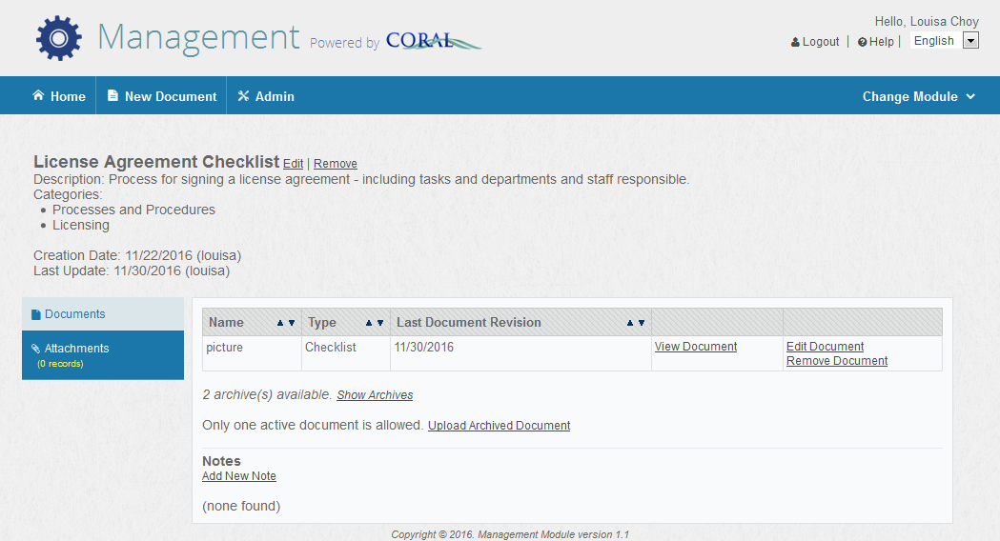

CORAL Management User Guide
---------------------------------

### About CORAL Management

Developed by Texas A&M University, CORAL Management provides a way to store and access digital copies of documents related to the overall management of electronic resources.

### Component Overview

CORAL Management has three components in the main navigation at the top of each page.

•	Home

•	New Document

•	Admin

### Home

Document records are listed alphabetically by name and the name field can be searched. Additionally, the records can be filtered by category and document type.

### New Document

Select New Document from the main navigation to begin adding new document records. This will open the New Document pop-up window.

- **Name**: The document name to be uploaded. The Management module only allows one active document per record so a document named Sample Letter to Excess Download Offender would only include a copy of the letter.

- **Description**: A brief explanation of the document, if necessary.

- **Type**: The type of document. The options listed in the dropdown box may be created from the Admin tab or by using the ‘add type’ link under the dropdown box. In the case of the Sample Letter to Excess Download Offender, the type could be template.

- **Last Document Revision**: The date the document was last revised. If no date is entered, today’s date is used by default.

- **Categories**:  The group of documents to which the document belongs. A document can be included in more than one category. For example, the document *License Agreement Checklist* could be in both an ‘Processes and Procedures’ category and a ‘Licensing’ category. Categories may be created from the Admin tab or by using the ‘add category’ link under the ‘Categories’ selection box.

- **File**: Selecting the ‘Browse…’ button opens the navigation pane used to browse and upload the document.

- **Archived**: Used to identify documents that have been superseded by a newer version of the document.

- **Add Optional Note**: Allows notes to be linked to the document by opening up two additional fields. 

**Note** provides a space to add any notes about the document.  **Note Type** provides a way to categorize the type of note. The options listed in the dropdown box may be created from the Admin tab or by using the ‘add type’ link under the dropdown box.

  

### Editing a Document Record

Once a document record has been created, the document record opens. A document record can also be opened by selecting it from the ‘Home’ screen.

The above record is for a License Agreement Checklist. Below the name is the description of the document, the associated categories, the documents creation date and creator, and the date the record was last updated and by whom. 

In this example, there are two archived versions of the checklist as evidenced by the “2 archive(s) available” note. Selecting ‘show archives’ makes these copies visible and accessible. To add another archived version, select ‘upload archived document’ and fill in the appropriate information. There can only be one current/active document. To add a new version of a document, the current document must be archived first. Once that happens, an ‘upload new document’ link will display. Select this and complete the necessary information to add the new version.

### Admin

The Admin tab provides for the management of users, document types, note types, and categories.
