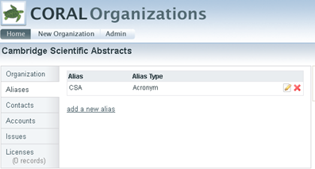
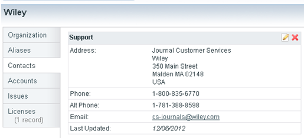
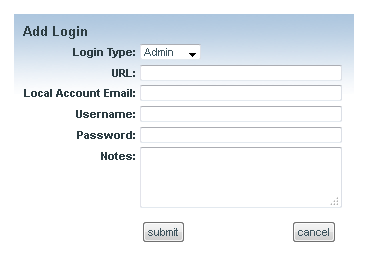
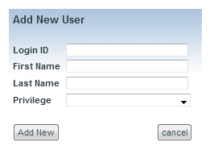

CORAL Organizations User Guide
------------------------------

### About CORAL Organizations

CORAL Organizations provides a way to manage contact and account information for variety of organizations customized by the user.  Some out-of-the-box organizations include publisher, provider, vendor and consortium.

CORAL TIP: New installations pre-populate the Organizations module with numerous organization names.    

### Component Overview

CORAL Organizations has three major components in the primary navigation at the top of each page.

• Home

• New Organization

• Admin

### Home

The home screen contains a search on the left and a list of organizations on the right.  The up and down arrows in the table header can be used to sort the organizations by name, alias, parent, or role.

There are four facets for search:

* **Name (contains):  **Searches against organization name and alias. For example, searching with AIP will retrieve the American Institute of Physics when AIP has been designated as an alias for this publisher.  

* **Role:  **Provides the option to limit a search by an organization’s role (ex. publisher, provider, library, consortium, etc)

* **Contact Name (contains)**: Search for the name of a known contact (ex. Jane Smith) instead of searching for the name of the organization.   

* **Starts with: **this A-to-Z browsing list can be used to browse all the entries alphabetically by the first letter.  

These facets can be used in conjunction.  

### New Organization

Organization Name?

image of Add New Organization screen

Select New Organization from the main navigation to begin adding new organization records.

* **Name**:  Name of the organization (i.e. MetaPress, Sage Publications, etc). This is the only required field.

* **Parent:** Name of the parent organization (i.e. Proquest as parent of Chadwyck-Healey). The purpose of the ‘Parent’ field is to relate multiple organizations together and to create an organization hierarchy. The field includes an auto-fill populated by existing organization records. The parent organization must already have an existing organization record in order for it to be assigned. Each organization may have only one parent assigned but multiple organizations may have the same parent thereby creating a useful parent-child hierarchy.

* **Company URL:**  Intendedmeant to be the url of the organization’s homepage.

* **Role(s):  **the organization’s role. The values for this field can be customized through the [Admin](#bookmark=id.26in1rg)page.

* **Account Details: **Account numbers or general descriptive info about a library’s account with the organization.

* **Notes:** General notes.

### The Organization Record

Here is an organization record for Cambridge Scientific Abstracts. The information on the record is split among five tabs. The sixth tab labeled Licenses appears when the CORAL Licensing module is installed and enabled.

* **Organization: **Displays the information found on the New Organizations screen explained on the previous page.

* **Aliases:** Alternate names and acronyms so that the record can be retrieved using various names.

* **Contacts:** Includes contact information for the organization (ex. Email, phone numbers for sales reps).

* **Accounts: **Logins for managing administrator accounts (ex. Username/password logins for usage statistics collection).

* **Issues: **Recording major incidents with the organization and/or its resources (ex. Publisher changed servers and access was lost for several days).

* **Licenses:** Links to the records in CORAL Licensing for all licenses from the organization. This is an interoperability feature which can be activated when both CORAL Licensing and CORAL Organizations are installed.

#### Organization

The figure above shows the organization tab for Cambridge Scientific Abstracts. Notice that this screenshot does not display the ‘Account Details’, ‘Notes’ or ‘Company URL’ fields that were found on the New Organization window on the previous page. These three fields are not displayed because no data was entered into those fields when the record was added.

The ‘edit organization details’ link will open up a window that allows you to edit the information originally entered in the New Organization’s window.

In this example Cambridge Scientific Abstracts has been assigned ProQuest as the parent organization. The ‘view’ link next to ProQuest LLC will open the ProQuest organization record.

#### Aliases

The Aliases tab allows the user to add multiple aliases for the organization.  The default alias types are Alternative Name, Name Change, and Acronym.  These fields can be customized using the [Admin](#bookmark=id.26in1rg)page

#### Contacts

The Contacts tab allows the user to add contact information for both specific personnel and general support.  None of the fields are required except for Role(s).

The values for the ‘Role(s)’ field can be customized through the [Admin](#bookmark=id.26in1rg)page. When the contact is no longer accurate, it can either be deleted or archived for historical tracking purposes. Contacts that have the ‘Archived’ box checked are kept in the system but are collapsed beneath a ‘show archived contacts’ link so that all users know that the contact information is out of date.

The ability to delete a contact has been restricted to users with admin privileges.

#### Accounts

The Accounts tab is used for storing login information that library personnel use for site administration, gathering usage statistics, etc.

Account login information can be entered in either CORAL Organizations or if installed, CORAL Resources. Account login information which is resource specific may be entered in CORAL Resources. Account login information that is not resource specific (ex. A single administrator login for all Gale databases) should be entered here in CORAL Organizations. Information stored at the organization level will be inherited by individual resources within CORAL Resources.

Add new login information by selecting the ‘add new external login’ link.

Most of the fields are self-explanatory, with the exception of

* **Login Type:** Default values are Admin, FTP, Marc, Statistics, Support, Other.

* **Local Account Email: ** The address of the library personnel registered on the account.

#### Issues

The Issues tab is meant for recording general information about an organization that may be valuable over time. One example would be recording when an organization has frequent breaks in access or significant server downtimes. Another example would be having an organization that is often slow when it comes to sending out renewal invoices. The ‘add new issue’ link opens a new window which includes a date and notes field. It is a simple field but it may come in handy for recording the institutional knowledge that exists among various personnel.

#### Licenses

The Licenses tab is only available when CORAL Licensing has been installed and the interoperability enabled. This tab will provide links to the license records within CORAL Licensing for all licenses where the organization has been identified as the Publisher/Provider. The hyperlinked license name will open the license record in a new window.

#### Admin

The Admin page is where you can manage user privileges as well as edit the values for organization role, contact role, alias type and external login type. As with the other modules, CORAL Organizations is designed to work with your campus authentication system (see the technical documentation for details). All valid users are given view only access when logged into CORAL Organizations unless they have specifically been granted additional privileges. You only need to add specific user accounts for personnel that need more than view only privileges. The available privileges are ‘view only’, ‘add/edit’ and ‘admin’. The ‘add new user’ link on the Admin page opens the following window where ‘Login ID’ is the user’s campus ID.

Privileges

* Admin : provides full add/edit rights including access to the Admin page and the ability to delete contacts.

* Add/edit : provides ability to add/edit organization records and all available fields but does not grant access to Admin page and does not give permission to delete contacts.

* View only : provides only the ability to view existing organization records.

