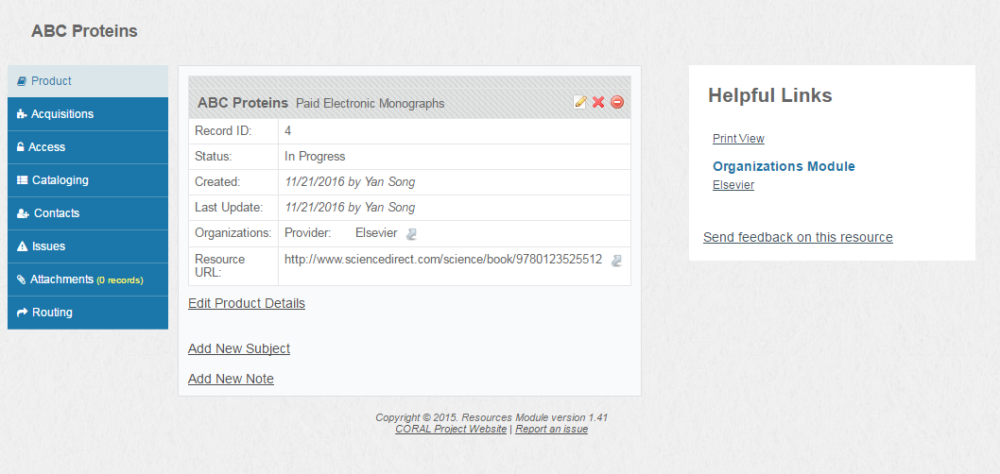
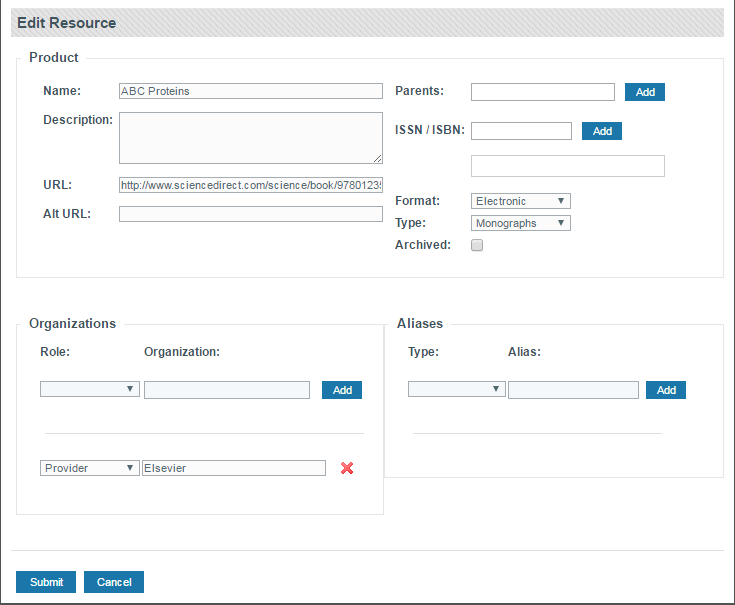
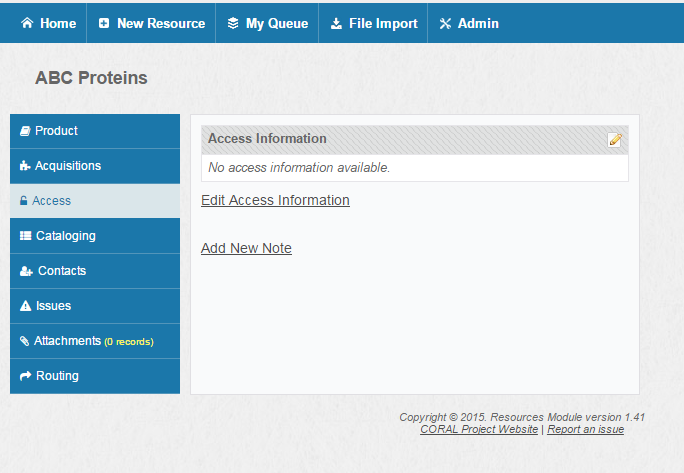
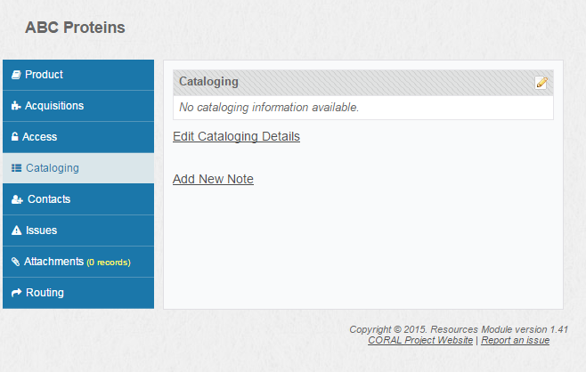
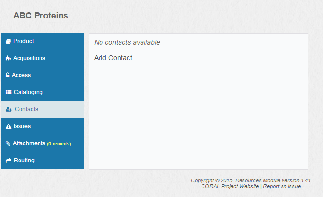
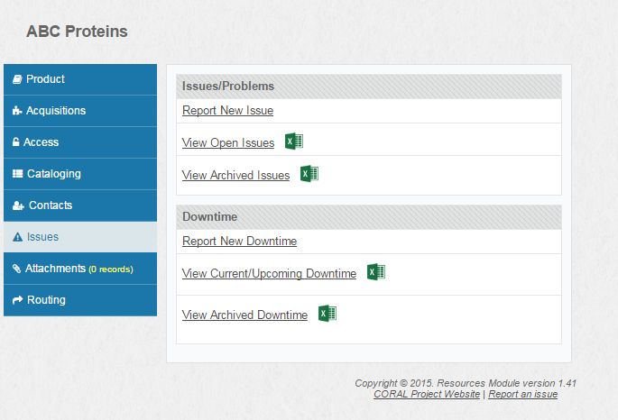
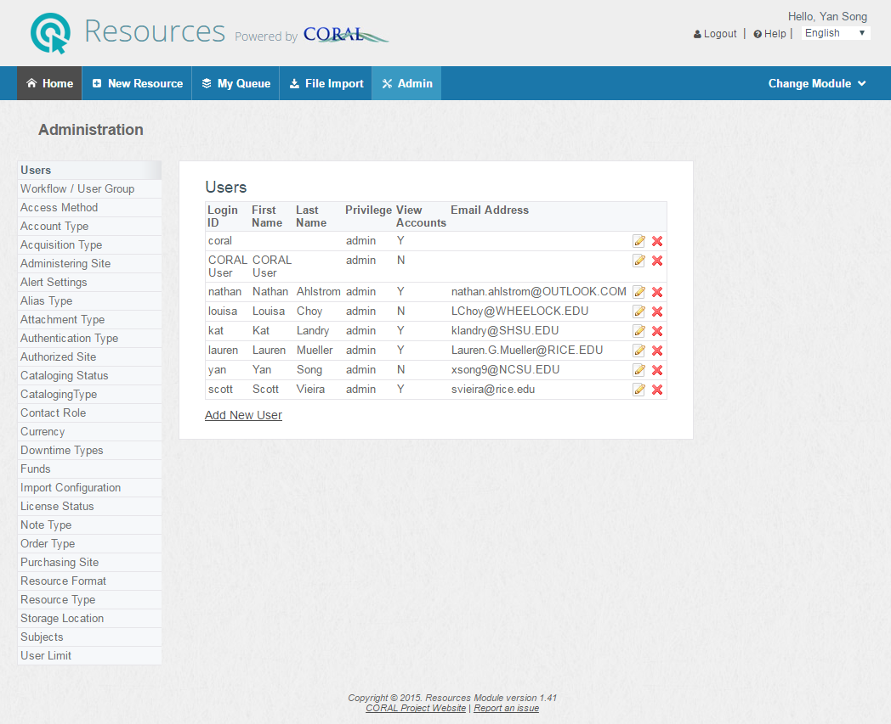
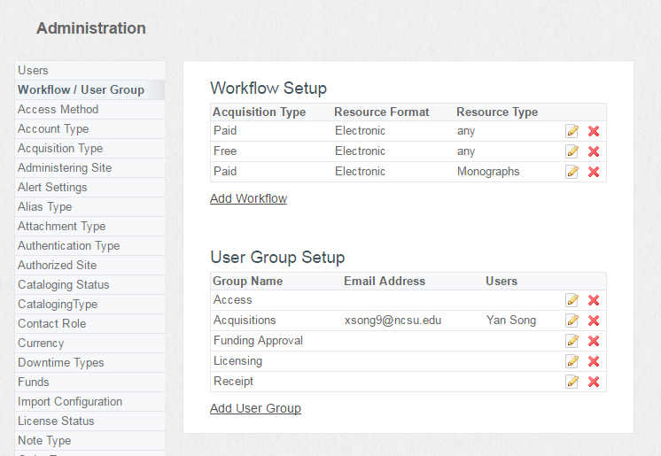

CORAL Resources Module User Guide
---------------------------------

### About CORAL Resources

 A component of Hesburgh Libraries locally developed ERM, CORAL
 Resources aids in the management of the electronic resource workflow
 from the initial request through the acquisition process and into
 ongoing support and maintenance. CORAL Resources supports the
 completion of these workflow processes with a convenient task-based
 queue in which automated email alerts indicate to staff when new tasks
 are available.

### Component Overview

 CORAL Resources has five major components in the primary navigation at
 the top of each page.

 • Home

 • New Resource

 • My Queue

 • File Import

 • Admin

### Home
========

Home provides both search and A-Z browse access to the resource records.
The *Name (contains)* field searches against resource name, resource
alias, parent resource name and organization name. The sidebar also allows for searching across the Publisher, Platform, and ISBN/ISSN fields for more specific searching. Multiple fields can
be combined in a single search for more precise searching. Search
results can be exported to a spreadsheet using the excel icon in the
upper right corner. The exported file includes more fields than what are
displayed on the search results page.

All new resource records are added through this form. The form includes
only select fields which are the most critical for processing new
resource requests. The goal was to provide collection managers with a
simple and easy to use form for submitting new resource requests. The
only required fields are resource name, format and acquisition type.

The *Format* field is meant to indicate the publication medium requested
with the most obvious values being print and electronic. *Acquisition
Type* is primarily meant to indicate the distinction between paid and
free resources. CORAL users may define their own Acquisition Type to meet the local needs. *Resource Type* is optional and provides additional
context to the type of resource being requested. The values listed for
all three of these fields can be edited through the Admin page detailed
later in this user guide.

The form allows the option to either save or submit the information
entered. The submit option will commit the new request and the system
will initiate the workflow for that resource and will send out an email
alert that a new resource has been entered. The save option will save
the information to the user’s *My Queue* page *Saved Requests* where it can be completed
and submitted at a later time.

Please note that the system does allow duplicate records for the same
resource to be entered. The form will however alert the user that
another record with the same resource name already exists.

### The Resource Record
#### Product

The resource record contains nine tabs where the information about the
resource is logically grouped. The first tab, *Product*, contains the
descriptive information such as name, alias, issn, publisher, etc which
identifies and defines the resource.

#### Edit product details

 The information on the *Product* tab can be edited by following the
 *Edit Product Details* link or by using the edit icon on the tab. The
 Name, Description, URL, Format and Resource Type fields come from the
 Add New Resource form. The Parent field identifies a related parent
 resource and includes an auto- complete feature populated by existing
 resource records that already exist in the system. An example of a
 possible Parent relationship would be that between ISI Web of Science
 (as the parent) and ISI Proceedings Index. Another example could
 include a package record identified as the parent of a record for an
 individual journal.

The *Product* tab allows for the addition of multiple associated
organizations and aliases. The values for the Organization Role and
Alias Type fields can be customized through the *Admin* page detailed
later in this document. The Organization field includes an auto-complete
feature populated by the organizations which already exist in the
system. A link to the organization’s record in the Organizations Module
will appear in the ‘Helpful Links’ box, shown in the previous figure
above, if the Organizations Module has been installed and the
interoperability enabled. Please see the Technical Documentation and
Install Guide for details on the proper configuration settings to enable
this feature.

The Archived checkbox on the Edit Resource screen will set the record
status as ‘Archived’. This was intended to be used to identify resources
that were no longer available but for which there was value in retaining
a record in CORAL.

#### Add new note

An additional notes feature has been added to the *Product*,
*Acquisitions* and *Access* tab. The note will be visible only on the
tab on which it is added. The Note Type field has been included to
provide context to the note. The values for the Note Type field can be
customized through the *Admin* page.

#### Orders

The Orders information allows for tracking of multiple orders for each resource.  Users can choose between "create new order," "clone order," and "edit order information."  

#### Create and Edit order information

 The order information can be created, cloned, or edited by using the create, clone, or edit order links located under Orders. The orders information is meant to provide description to local acquisitions. The *Acquisition Type* field is the same as was entered on
 the add new resource form.  

The *Acquisitions* tab also includes the ability to track subscription
periods and alert when the period expires. Enter a valid subscription
end date and then check the ‘Enable Alert’ checkbox in cases where a
subscription expiration alert is desired. The alert settings can be
customized through the *Admin* page. The settings include the ability to
set the email address to which the expiration alert will be sent (note
this is a global setting) and the alert period. For example the alert
can be set to activate on a specific number of days prior to the
subscription end date. In order to implement the alerts feature the file
sendAlerts.php will need to be run as a nightly cron. See the technical
documentation and install guide for details.

Order Number is intended for the ILS order
number and system number for the ILS bib system number. A link to the
resource record in the libraries’ web OPAC can be dynamically displayed
on the *Acquisitions* tab when a bib system number is entered. See the
technical documentation and install guide for the necessary settings in
the /admin/configuration.ini file to enable this link. Purchasing Site is 
intended to indicate the library or organization purchasing the resource. 
The values can be customized through the *Admin* page. Order number and 
System Number fields are meant to provide match points with the ILS. 

#### Acquisitions

 The Acquisitions tab contains details of the libraries’ acquisition of
 the resource such as order number, cost, fund, license status, etc.

#### Edit Cost History

Additional cost history can be added through the *Edit Cost History* link. This allows to track cost history for the same resource. 

Note: If enhanced cost history is enabled, then the user will see the following additional fields.

#### Edit license and status

 The *Acquisitions* tab includes information about the relevant
 license. Use the *Edit license and status* link or the matching icon to
 update the license information. The values for the Licensing Status
 field can be customized through the *Admin* page. Changes to the
 Licensing Status field are recorded in the History section. It is also
 possible through the Edit License window to associate the resource
 with all relevant license records in the Licensing Module. The License
 Record field includes an auto-complete feature that is populated by
 the names of all license records in the Licensing Module. See the
 technical documentation and install guide for the necessary settings
 in the /admin/configuration.ini file to enable this functionality. A
 link to each associated license is added to the Helpful Links section
 of the resource record for quick navigation between modules.

#### Access

The *Access* tab includes the information about how the resource is
accessed including things such as IP versus username/password
authentication, simultaneous user limits, authorized sites, etc. The
access information can be edited by using the edit access information
link or the matching edit icon.

#### Edit access information

 The values for all fields on the *Access* tab except for username and
 password can be customized through the *Admin* page. The Authorized Site
 field is intended to indicate the sites or libraries which are
 permitted to use the resource. Administering Site is intended to
 indicate the site or library which is responsible for managing the
 access. The remaining fields provide the technical details of the
 access.

 Authentication Type is intended to indicate how the resource is
 authenticated, such as IP or user/password login. Access Method is
 intended to indicate where the resource is accessed. This field was
 primarily added to identify resources that were hosted locally,
 perhaps on a citrix server or in an institutional digital repository,
 rather than on the publisher or provider’s website. Storage Location
 is intended for resources that have a physical component such as a CD
 or hard-drive backup to indicate where the resource is held.

 The Username and Password fields on the *Access* tab are intended for
 use when the resource is accessed by patrons via a shared username and
 password login. This is not the login information used for resource
 administration. Administrative logins are to be stored on the
 *Accounts* tab.

#### Cataloging

 

 The *Cataloging* tab includes data and workflow information related to
 cataloging the resource, including things such as the URL of where the
 cataloging records are coming from, cataloging type, cataloging
 status, and the number of records available and loaded. The cataloging
 information can be edited by using the *Edit Cataloging Details* link or
 the matching edit icon.

#### Edit Cataloging Details

 The Cataloging Status and Cataloging Type fields can be customized
 through the *Admin* page. The Identifier can be an ILS bib record ID. 
 The Source URL is intended to be the source of the catalog
 records used. The Cataloging Type is intended to
 indicate the cataloging approach. Values might include: Batch, Manual,
 and MARCit. The Cataloging Status is intended to identify the
 current status of the cataloging work. Values might include:
 Completed, Ongoing, and Rejected. Checking the OCLC Holdings checkbox indicates that the
 resource is made available in OCLC.

#### Contacts

The *Contacts* tab is the same as is found on an organization record in
the Organizations Module. It is intended as a directory of contact
information for publishers, vendors, etc. Contacts can be added directly
to the resource record using the add contact link or they can be
inherited from the Organizations Module, as in the figure above. When an
organization is associated with the resource on the *Product* tab all
contacts that exist for that specific organization will be inherited and
displayed here on the *Contacts* tab. As with Organizations, the
Resources Module includes a Contact Role field for each contact
(support, invoicing, etc). The values for Contact Role can be edited
through the *Admin* page.

#### Account

The *Accounts* tab is the same as is found on an organization record in
the Organizations Module. It is intended to store the login credentials
used for administrative tasks such as registering ip addresses,
downloading usage statistics, and other administration tasks. Accounts
can be added directly to the resource record using the add new account
link or they can be inherited from the Organizations Module, as in the
figure above. When an organization is associated with the resource on
the *Product* tab all accounts that exist for that specific organization
will be inherited and displayed here on the *Accounts* tab. As with
Organizations, the Resources Module includes a Login Type field. The
values for Login Type can be edited through the *Admin* page.

#### Issues

Issues related to a resource can be recorded in the *Issues* tab. Users can report an issue, view open issues or view archived issues. Downtime can also be recorded under Downtime section, where users may report a new downtime, or view current/upcoming downtime or view archived downtime.    

The *Report New Issue* link allows users to enter a new issue. There are several required fields marked with a red star. To add a contact, use the *Add Contact* link. Users may choose to CC themselves or add additional CCs. All contacts and CCs will receive an email alert about the issue. Fill in the Subject field and a brief description about the issue in the Body field. The *Applies to* check box has three options and users can select only one of them. For the *Applies to all Project Euclid resources* option (shown in the example here), the issues will be recorded for all Project Euclid resource records in CORAL. If *Applies to selected Project Euclid resources* option is selected (as shown in the figure), a list of the available resources from the same organization will show up and users can select one or multiple items on the list. In the example shown, both items on the list are selected. 

To look at all open issues, users can click on *View Open Issues* link and all open issues will be expanded below the linking text. Open issues can be closed by clicking on the *Close* link in the same view. See screenshot above. Open issues can be downloaded in a csv file by clicking on the excel icon beside the text View Open Issues. 

The *View Archived Issues* link will display all archived/closed issues. Users can also download closed issues in a csv file by clicking on the excel icon. 

Users can record downtime related to the resource record via the *Report New Downtime* link. The downtime report includes downtime start date, downtime resolution date, problem type and some notes. Please note, when it reaches the downtime resolution date, the downtime report will be archived automatically. If the Downtime Resolution date is not entered here, a *Resolve* link will show in the *View Current/Upcoming Downtime* link shown the figure below. Problem Type can be configured in *Admin* Downtime Type tab. New downtime can also be entered in the Organizations Module. Please note Report New Downtime in Organizations module is an optional feature, which can be turned on by updating the Organization module configuration file (resourceIssues=Y).

The *View Current/Upcoming Downtime* will display all current or upcoming downtime reports, either organizational level or resource level. To archive/close a downtime report, click on the *resolve* link and the archived downtime should appear in the *View Archived Downtime* section. Please note, there is a bug here, resolved downtime reports are not displaying in the designated section. A bug fix is in progress. Organization related downtime should be entered in the *Organization* module. 

#### Attachments

Additional documents relevant to the resource can be uploaded and made
available through the *Attachments* tab. Multiple attachments are grouped and sorted by attachment type.

 New attachments are added using the *Add New Attachment* link. The Name
 field is intended to be a descriptive name for the attachment. The
 Details field allows for any additional information that further
 explains the attachment. The attachment Type field (email, title list,
 etc) provides context and allows for a way to group the attachments.
 The values for attachment Type can be edited through the *Admin* page.

#### Workflow

The *Workflow* tab shows the workflow through which the resource needs to
follow. The workflow and routing rules can be customized through the
*Admin* page. That process is described later on in this document.

The figure above shows a sample workflow. The first column ‘Step’ is the
name of the task which needs to be performed. The second column ‘Group’
identifies the group responsible for the task. Individuals are assigned
to these groups through the *Admin* page. The ‘Start Date’ identifies
the date at which the task become active. An email is sent to the
assigned group when the task becomes active alerting the group members
that they now have a task to perform. The fourth column
‘Complete’ will identify the date when the task is completed and the
person who complete the task. Clicking the ‘mark complete’ link will
mark the task as complete. The last column "Delete" allows users to delete
any unnecessary step. Please note the deleted steps only apply to this local resource record
and it will not overwrite the workflow steps in *Admin* tab. 

There are two additional steps which happen as part of each workflow
that are not identified as tasks on the *Routing* tab. An email alert is
sent out by the system when a new record is added. The email is sent to
a master email address that is specified in a configuration file
(configuration.ini). The variable which sets the email address is named
‘feedbackEmailAddress’. See the technical documentation and installation
guide for instructions on editing the configuration file. An email alert
is also sent out to this same address when all of the workflow steps
have been marked as complete. The text of the email alerts is controlled
through the use of template files. The templates exist in the
/admin/emails/ directory. See the technical documentation and
installation guide for more information on editing the email templates.

Workflow steps can be reassigned to a group by clicking on the pencil icon beside the group name.
As shown in the figure above, selecting a group from the dropdown list will assign the step to a selected group. 
The reassignment can apply to all later steps if the checkbox 
"Apply to all later steps" is selected. 
 
The *Routing* tab includes four additional features displayed as links on
the bottom of the page as seen in the screenshot of Routing. The *restart
workflow* link allows anyone with admin privilege to restart the entire
workflow process, either in-progress workflows or completed workflows. 
All completed workflows will be archived automatically and can be viewed 
through the *Display Archived Workflows* link. The *mark entire workflow complete* link marks the
entire workflow as complete even if there are unfinished tasks.

The *Edit The Current Workflow* link will open a Edit Workflow window, where users can make changes to the workflow. Available edit options include: add a new step, delete a step, assign a group to a step, assign parent step, move a step up or down and configure the number of days for the email reminder for any step.
Task reminders are often seen in task management software. The email reminder function will remind users after the configured number of days when the step is assigned to the assigned group/member. It's worth noting that the edits made here will not overwrite the workflow configuration in *Admin* tab. 

### My Queue

The *My Queue* page shows the user their recent activity and their
outstanding tasks. The page is divided into three tabs: Outstanding Tasks, Saved Requests,
and Submitted Requests. The *Saved Requests* tab
displays new resource records which the user has saved to their queue
but not yet submitted. The *Submitted Requests* tab displays the user’s
recently submitted records which are still in process. Once the
resource’s workflow is complete the record is automatically removed from
this tab.

The *Outstanding Tasks* tab, as shown in the figure above, displays the
resources for which the user has an active workflow task which has not
yet been completed. Clicking on the resource name or ID number will open
the full resource record. Resources are assigned to a user’s queue based
on their association with a workflow group. Resources are removed from
the user’s queue once the outstanding workflow task on the resource’s
*Routing* tab is marked as complete.

### File Import

File Import allows users to import a file into CORAL. Users may choose a file from a local drive. The file has to be a delimited CSV file with any of the three delimiter options: comma, semicolon or pipe delimited.
The upload button loads the CSV into CORAL.  

#### File Import Configuration

Next users need to configure the import settings in the Delimited File Import window. Users can select an existing import configuration, which is configured in *Admin* (see Admin section below for more details). Once selected, the column number will be populated in the form automatically. If users have not previously created an Import Configuration, then for each of the resource fields, users need to input the column number for each corresponding column in the CSV file. The column number for each column can be found right above the mapping fields in the top portion of the interface. For columns with multiple values that are character-delimited, indicate the delimiter using *If delimited, delimited by field*. For fields with values across multiple columns, add additional sets using the *+Add another* links. Use the *Dedupe on this column* option for ISBN/ISSN sets to ignore any duplicate values that might occur across those columns. The Alias Types, Note Types, and Organization Roles that you can assign to your mapped columns can be configured on the Admin page.
Users can also map a set of order related fields in the Acquisitions section, which contains Fund Code, Cost, Order Type and Currency. Lastly, users have the option to enable sending emails when starting workflows, which can be triggered automatically if records imported have the fields (Resource Format, Resource Type and Acquisition) matching with any existing workflows. If users don't want to bothered with the email notification, then leave this option unchecked.  

Once submit, users will be taken to the import preview window. (shown in the screenshot below). 

#### File Import Report Preview

The preview allows users to look at the import summary and choose to either proceed with the import or go back to the field mapping windows if anything goes wrong. 

After the import is finally submitted, it'll take users to the final results page. The import will be archived and users can access it again in Imports history. 

### Admin

The *Admin* page is available only to users with admin privileges. It is
the page through which field values are customized and through which
user privilege and access is set.

#### Edit User

The first tab on the page is for editing user accounts. There are three
privilege levels for the Resources Module; add/edit, view only, and
admin. View only is the default privilege for all users who do not have
an existing user entry granting them additional privileges. The
*Accounts* tab on the resource record may contain sensitive login
credentials that only a select few users need to see. Checking the ‘View
Accounts’ box on the edit user form will allow the user to see the *Accounts* tab, for
all other users the *Accounts* tab will be hidden.

#### Workflow / User Group

The *Workflow / User Group* tab contains the settings which control the
workflow routing features. The Resources Module allows for the creation
of multiple workflow rules based on resource type. The figure above
shows three workflows including one for paid electronic resources, one for free electronic resources and one for paid electronic monographs. New workflows are added using the add workflow link. Users can also copy any existing workflows by clicking on the yellow duplicate icon. 

#### Edit workflow

 The above figure shows the form through which workflows are created
 and edited. Here again the workflow being edited is for resources
 where the Acquisitions Type is ‘Paid’ and the Format is ‘Electronic’.
 These two fields are required and as such it is required that the
 values for these fields be defined before creating new workflows. The
 Resource Type field is optional but when used allows for more granular
 workflows.

The Workflow Steps section allows for the addition of as many steps (or
tasks as this document also calls them) as desired. Enter step name, the
group assigned to the step and the parent step when appropriate. Then
click the ‘Add’ button to add the step to the workflow. Assigning a
group to each step is required and as such it is necessary to create the
groups before creating workflows.

The blue arrows on the left side of the form determine the display order
in which the workflow steps will appear on the *Routing* tab. The arrows
do not determine the order in which the steps occur in the workflow.
That order is determined by the Parent Step. Workflow steps that have no
parent step assigned will become active as soon as the new record is
submitted. Workflow steps that have an assigned parent step will become
active once the parent step is marked as complete.

#### Edit user group

Each step or task in a workflow must be assigned to a user group. Enter
a group name and a group email address. An email alert will be sent to
this address when a new workflow step assigned to the group becomes
active. Users that are assigned to the group will then have the
in-process resource appear on the *Outstanding Tasks* tabs of their *My
Queue* pages.

#### Import Configuration

Here, users can add a new import configuration or edit an existing configuration. 

The instruction for adding a new one or editing an existing one is similar to what's in File Import section described earlier and a configuration name can be entered here. The corresponding column number in the importing csv file can be entered for any field shown in the screenshot. 

 
#### Other Admin Settings

There are many other fields which can be customized through the *Admin*
page. Select the field you wish to edit in the left hand column and then
follow the *add new* links or the edit and delete icons to customize the
field values. The fields have each been described in context earlier in
this document. There is however an additional setting managed here on
the *Admin* page which needs to be described in more detail; Alert
Settings.

#### Alert settings

These alert settings determine the functionality of the alert feature
associated with the subscription period end date on the *Acquisitions*
tab of the resource record. Enter the email address to which the alert
should be sent when the subscription period for a resource comes to a
close. Then enter the number of days prior to expiration that you wish
the email alert to be sent. For example, entering 30, 60, 90 days would
result in the system sending an alert 90 days prior to the subscription
end date, 60 days prior and 30 days prior. The system will also send an
alert on the exact day of the subscription end date.
