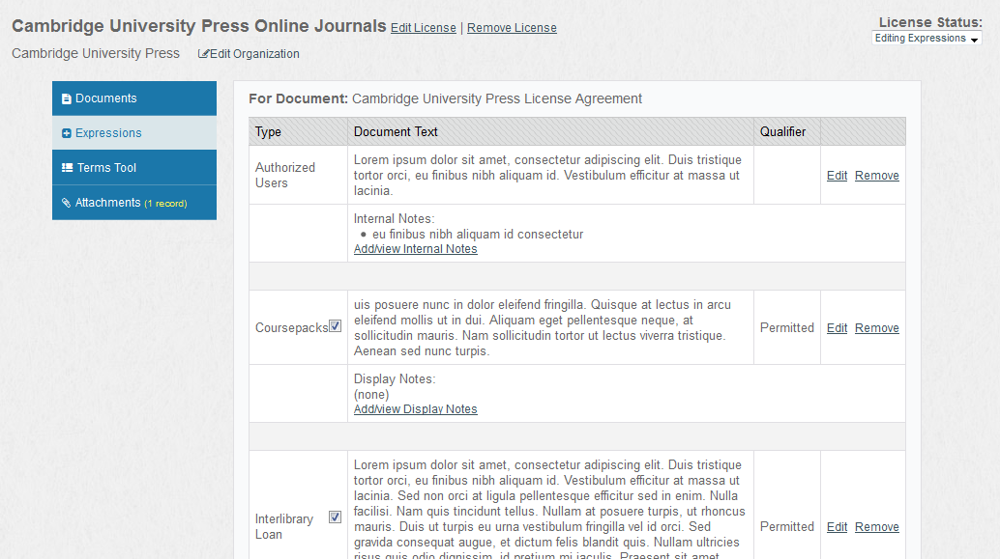
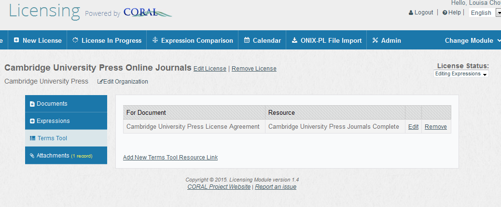
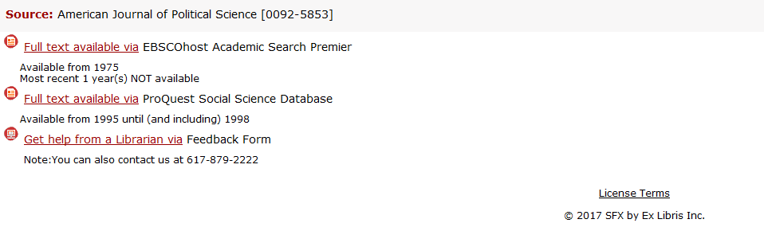

Terms Tool User Guide
---------------------

### About the CORAL Terms Tool

An add-on to CORAL Licensing, the Terms Tool enables key stakeholders such as interlibrary loan staff to view the license terms without needing direct access to CORAL Licensing. The tool allows authorized users to retrieve license terms for a specific resource based on an ISSN or ISBN query. In addition to CORAL Licensing, the Terms Tool requires the installing site to have either the SFX, or EBSCO Full-text Finder openURL link resolver (or alternatively any openURL resolver with an API). The Terms Tool queries the openURL link resolver for a specific ISSN or ISBN, retrieves the list of available providers for that ISSN/ISBN, and then queries CORAL Licensing for the license terms for each provider. It is a multi-step process but it all takes place behind the scenes and results in a seamless easy to use process for the user.
direct access to CORAL Licensing. The tool allows authorized users to retrieve license terms for a specific resource based on an ISSN or ISBN query. In addition to CORAL Licensing, the Terms Tool requires the installing site to have either the SFX or SerialsSolutions openURL resolver (or alternatively any openURL resolver with an API). The Terms Tool queries the openURL resolver for a specific ISSN or ISBN, retrieves the list of available providers for that ISSN/ISBN, and then queries CORAL Licensing for the license terms for each provider. It is a multi-step process but it all takes place behind the scenes and results in a seamless easy to use process for the user.

*Please note that screenshots and text in this document are just examples and do not necessarily reflect terms for a particular resource.*

### Enabling the Terms Tool

The process of using the Terms Tool begins with the license record within [CORAL Licensing](http://coral-documentation.readthedocs.io/en/latest/licensing.html). The first step is for the licensing personnel to create a license record with completed expressions as in the following screenshot.

This license record  shows both the *Coursepacks* and *Interlibrary Loan *expressions for the license agreement titled "Cambridge University Press License Agreement". There are two important items to note about these expressions that directly impact the terms tool:

1. The expressions are using *Display Notes* rather than *Internal Notes*. Each expression type can be configured within the CORAL Licensing Admin tab to use either Display or Internal Notes. Only those expressions which use *Display Notes* are made available through the Terms Tool. 
2. Note the presence of the checkbox next to the expression type. This is the Terms Tool Checkbox. It is used by the licensing personnel to indicate that the expression is completed and is ready to be included in the Terms Tool. The action of checking this box will send out an email to the personnel managing the Terms Tool alerting them that new license terms are available. The recipients of this email are configured on the Admin tab of CORAL Licensing. The following screenshot shows the details of a user entry in CORAL Licensing. Any user with an email address in the *Terms Tool Email* field will receive the system generated email when the terms tool
 checkbox is selected.

### Mapping License Terms to Resources

At this point there is a completed license record showing the terms for the license agreement "Cambridge University Press License Agreement". The next step which needs to be completed is to identify which journals are covered by this specific license agreement. This is accomplished using the Terms Tool tab on the license record as in the following screenshot.

The task is to identify which journals are covered by the "Cambridge University Press License Agreement" license agreement. This is accomplished by making a connection between the license agreement and the list of journals as entered in the library’s openURL resolver. In this example all of the journals that are covered by the terms of the agreement were activated and entered as a distinct group within the  library’s openURL resolver. 

In SFX for example this is accomplished by  activating all the journals covered by the agreement within the same target. The target is then given a target public name of "Cambridge University Press Journals Complete" (serialsolutions calls this field databaseName). Then within the
Terms Tool tab of CORAL Licensing the link can be entered between
the document "Cambridge University Press License Agreement" and the SFX target named "Cambridge University Press Journals Complete". The Terms Tool will now know that all journals available within the "Cambridge University Press Journals Complete" target are covered by the terms of this specific license agreement.

The Terms Tool now has the information it needs to operate and can perform the query for license expressions. First the Terms Tool receives an ISSN via the url *https://{server name}/licensing/terms.php?issn={ISSN}*. The Terms Tool sends a query with the provided issn to the library’s openURL link resolver. The openURL link resolver returns an xml reply listing all of the provider names (SFX’s target public name, Ex Libris' Database Name, or EBSCO's equivalent) for the provided ISSN. The Terms Tool queries CORAL Licensing for all license agreements which have been mapped to each provider name and retrieves  all of the associated license terms from the identified license agreements. The terms are then displayed on screen to the user.

### Terms Tool in Action

The following screenshot shows the Terms Tool display for the journal "American Political Science Review" (issn 0003-0554).  This screenshot is taken from a live in-use terms tool instance that has customized expression types that differentiate between print and electronic.  

At this point the Terms Tool has already queried both the openURL resolver and then CORAL Licensing and identified that Coursepack, Course Reserves, and Interlibrary Loan terms are available for this journal. The link for Interlibrary Loan leads to the following screenshot.  

And in the above screenshot the user now sees the specific interlibrary loan license terms for this journal. Access to this journal is available via Cambridge University Press and interlibrary loan use is *Not Clear* (note that this is fabricated data).  

The *Display Notes* from the license record detail how the interlibrary loan is to be handled. The actual document text from the license agreement is hidden beneath a *view license snippet* link for those wishing to see the original language. The provider name at the end of the opening line is hyperlinked and will take the user directly to the provider’s webpage for the journal. 

The Terms Tool will display terms for all providers when the library does have access through multiple providers.  In this example, access is also provided through Proquest Education Journals.  If no interlibrary loan license terms are available for a provider the Terms Tool will show that as well as in the
following example:

Again, please note that the license terms in these screenshots are all
fabricated examples and do not reflect the actual terms of the
provider’s real license agreements. In the *American Political Science Review* example, access is also provided through multiple Gale databases but no license terms were entered for Gale in our system. 

### Finding the Terms Tool

 The Terms Tool is used by querying it with a url containing either an
 ISSN or ISBN such as
 [*http://coral.mylibrary.edu/coral/terms/?issn=XXXX-XXXX*.](http://coral.mylibrary.edu/coral/terms?issn=XXXX-XXXX)
 Using the Terms Tool requires some way for users to easily send this type of ISSN/ISBN query. In order to use the Terms Tool, the library's link resolver must be configured with the URL. To configure    consult documentation for the openURL link resolver used by your library. A number of options
 exist for how the Terms Tool could be implemented and utilized. It is up to
 the individual library to determine how they wish to create the necessary
 ISSN/ISBN links and use the Terms Tool.

### Technical Documentation

 Additional technical documentation for installing and implementing the
 Terms Tool is currently being worked on. 

